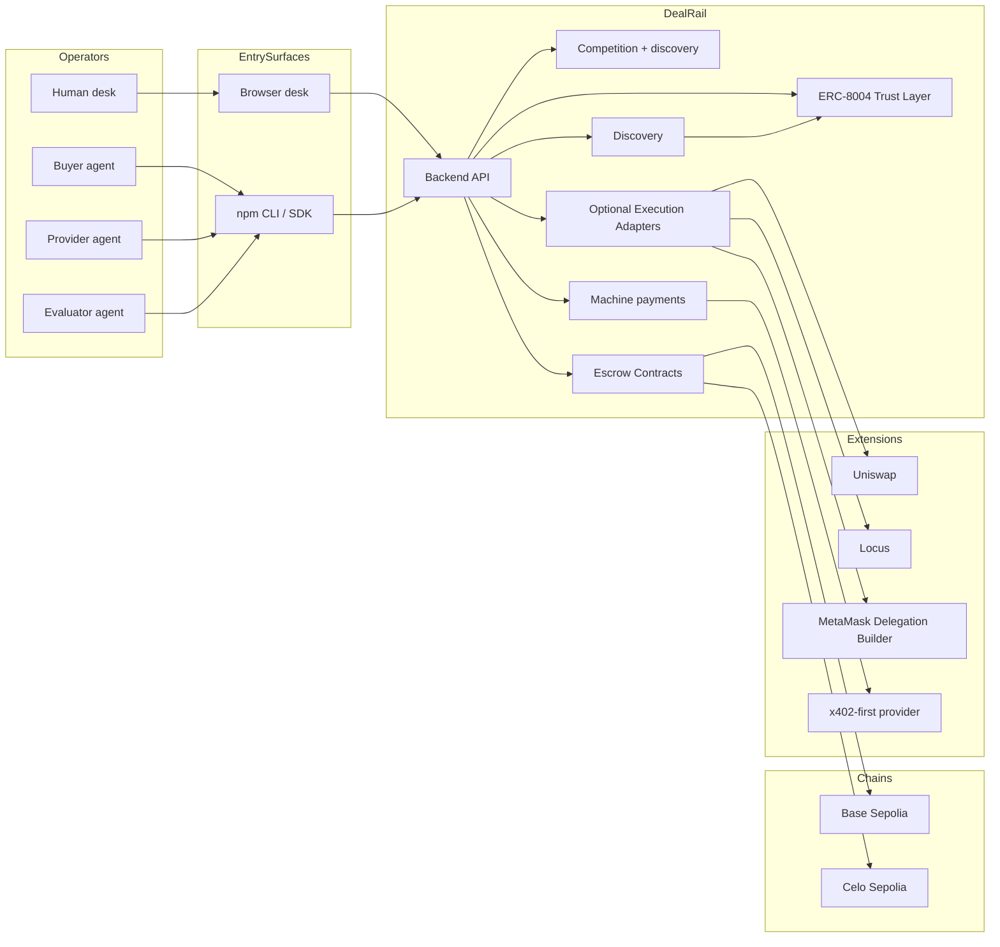
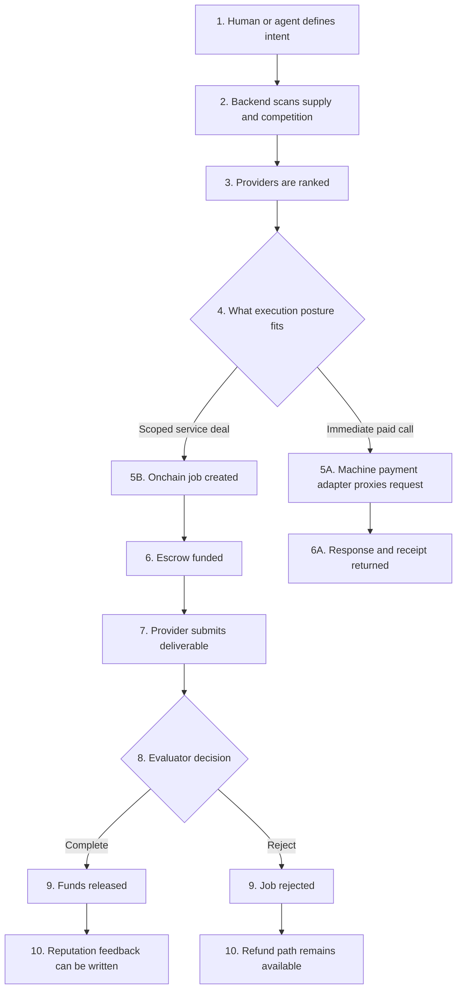
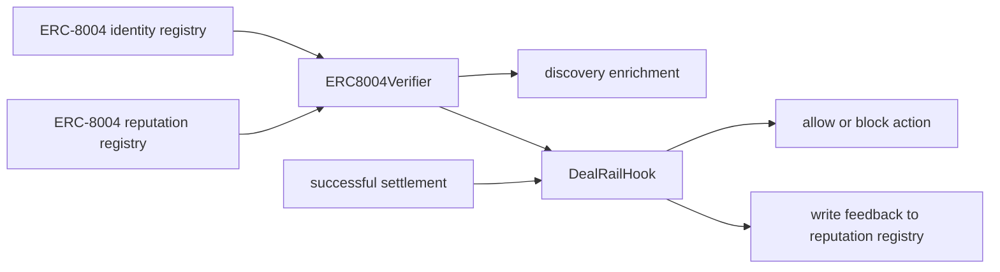
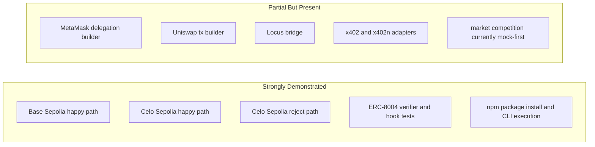

# Visual Architecture

This file is the human-friendly visual explanation of how DealRail works.

Use this if you want the quickest visual understanding of the system without reading every implementation note.

## 1. One-Line Thesis

DealRail turns an agent deal into a verifiable execution loop:

```text
intent -> scan -> offer -> machine payment or escrow -> evaluation -> receipt -> reputation
```

## 2. System Overview



## 3. What Each Layer Does

| Layer | Purpose | Main Files |
|-------|---------|------------|
| Browser desk | Human and judge-facing UI | `frontend/src/app`, `frontend/src/components` |
| CLI / SDK | Agent and terminal-native operator surface | `cli/src/cli.ts`, `cli/src/client.ts`, `cli/src/types.ts` |
| Backend | Lifecycle API and integration adapters | `backend/src/index-simple.ts`, `backend/src/services` |
| Escrow | Locks funds and enforces state transitions | `contracts/src/EscrowRail.sol`, `contracts/src/EscrowRailERC20.sol` |
| Trust layer | Checks identity/reputation and writes feedback | `contracts/src/DealRailHook.sol`, `contracts/src/identity/ERC8004Verifier.sol` |

## 4. Operator Modes

| Mode | Best for | First command or surface |
|------|----------|--------------------------|
| Human browser flow | Demo, judging, guided operation | `frontend/src/app/page.tsx` and `frontend/src/app/terminal/page.tsx` |
| Human terminal flow | Direct operator control | `npx @kairenxyz/dealrail doctor` |
| Agent runtime | Structured automation | `npx @kairenxyz/dealrail doctor --json` |
| Embedded integration | Custom orchestration | `import { DealRailClient } from '@kairenxyz/dealrail'` |

## 5. Canonical Deal Flow



## 6. Trust Loop

This is the part that makes the Protocol Labs / ERC-8004 story strong.



## 7. What Is Actually Demonstrated



## 8. Why The Repo Is Organized This Way

The repo is split so two audiences can navigate it quickly:

- humans need a simple visual story and direct evidence
- AI judges need structured markdown, exact file paths, tx hashes, and claim discipline
- agents need a stable install and JSON command surface

That is why:
- `docs/submission` is the canonical submission pack
- `backend/TRANSACTION_LEDGER.md` is the canonical proof log
- `STATUS.md` is the canonical deployment summary
- `@kairenxyz/dealrail` is the canonical agent package name

## 9. Best Reading Order For Humans

1. [`00_START_HERE.md`](00_START_HERE.md)
2. [`06_VISUAL_ARCHITECTURE.md`](06_VISUAL_ARCHITECTURE.md)
3. [`01_TRACK_MATRIX.md`](01_TRACK_MATRIX.md)
4. [`03_EVIDENCE.md`](03_EVIDENCE.md)
5. [`05_WINNING_STRATEGY.md`](05_WINNING_STRATEGY.md)
