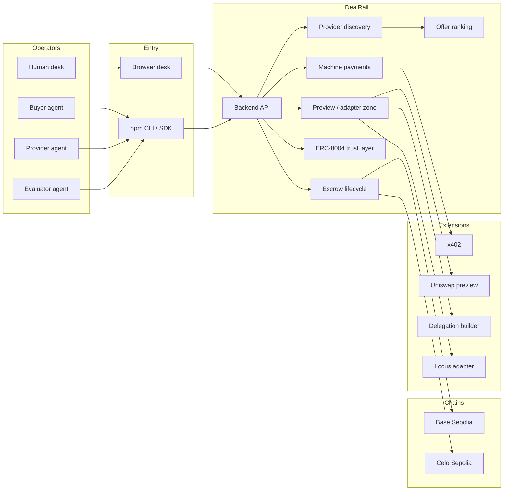
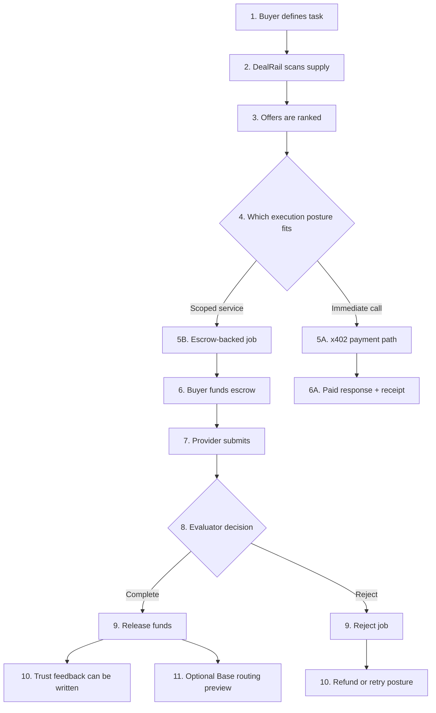
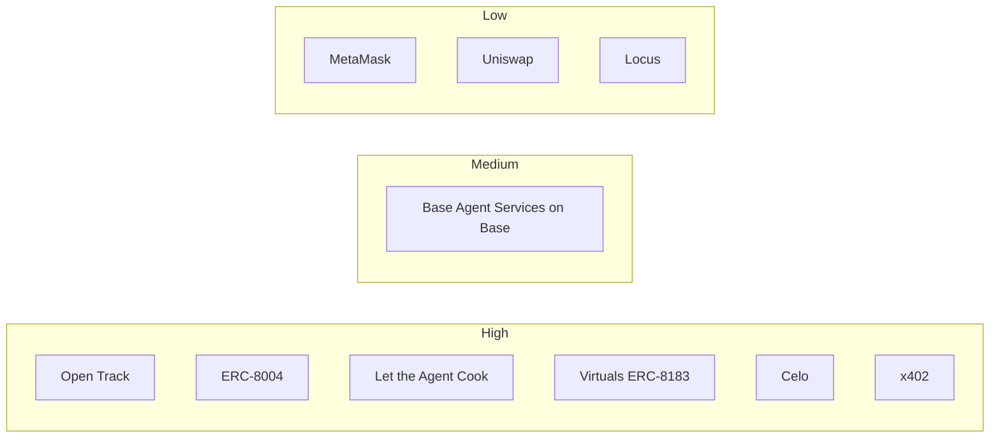
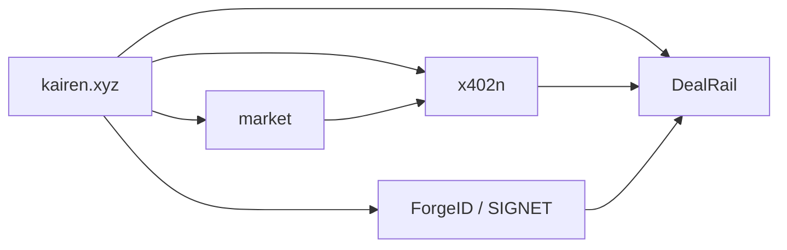

# Visual Architecture

This file is the quickest visual explanation of how DealRail works.

## One-Line Flow

```text
intent -> discovery -> offer ranking -> payment or escrow -> evaluation -> receipt -> trust feedback
```

## System Overview



## Deal Flow



## Confidence Map



## Kairen Stack Map



Meaning:
- `market` becomes public discovery
- `x402n` becomes live negotiation and transcripts
- `ForgeID / SIGNET` deepens trust and access
- `DealRail` stays the execution, settlement, and receipt desk
