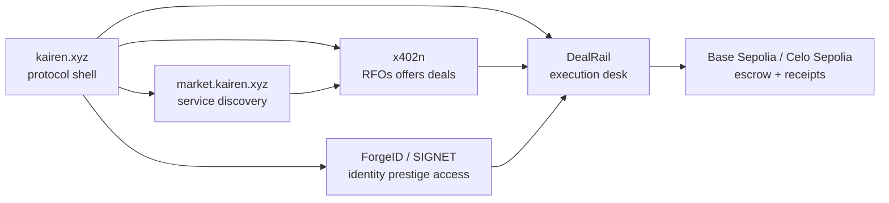

# Roadmap

This is the forward roadmap judges should use when evaluating DealRail's upside beyond the current hackathon build.

It is grounded in the live product plus the broader local Kairen protocol repos under `/Users/sarthiborkar/Build/kairen-protocol`.

## Current State

Today, DealRail is the execution desk in the Kairen stack:
- browser desk for humans
- npm CLI and SDK for agents
- backend coordination layer
- escrow and receipt rails on Base Sepolia and Celo Sepolia
- ERC-8004-aware trust hooks

## Kairen Protocol Map

## How The Local Kairen Repos Map In

### `website`
- source of the umbrella protocol brand at `kairen.xyz`
- frames Kairen as infrastructure for autonomous AI agents
- future role for DealRail: become the execution and settlement product linked from the main protocol surface

### `x402n`
- negotiation router and agent commerce stack
- core flow: RFO -> offers -> accept -> deal -> payment/delivery ledger
- future role for DealRail: use x402n as the live negotiation and transcript layer instead of a mostly demo/mock competition surface

### `market`
- public service discovery surface
- future role for DealRail: ingest provider catalogs, offer public service discovery, and make Base-facing paid services discoverable for sponsor tracks

### `ForgeID` / `SIGNET`
- identity, prestige, partner attestation, and access verification stack
- local materials already describe ERC-8004 integration and EVM mirror plans
- future role for DealRail: move from generic ERC-8004 compatibility into Kairen-native identity, prestige, and provider trust

## Delivery Phases

## Phase 1: Current Hackathon Product

Status:
- live now

Scope:
- browser desk on Cloudflare
- backend API on Railway
- published npm CLI package
- Base Sepolia and Celo Sepolia escrow flows
- ERC-8004 verifier + hook integration
- x402 paid-request proof on Base Sepolia

Goal:
- win with a truthful, evidence-backed execution desk

## Phase 2: Honest Agent Packaging

Status:
- next immediate sprint

Scope:
- add `agent.json`
- add `agent_log.json`
- document guardrails, tool boundaries, and budget awareness
- record one canonical autonomous run

Goal:
- raise Protocol Labs “Let the Agent Cook” from 70% toward 85%+

## Phase 3: x402n-Native Negotiation

Status:
- planned

Scope:
- route DealRail requests into real x402n RFOs and offers
- import transcript hashes and negotiation records
- attach accepted-offer metadata to escrow creation
- expose negotiation history in the browser and CLI

Why it matters:
- makes negotiation real instead of mostly simulated
- ties the Kairen negotiation stack directly into the commerce desk

## Phase 4: Market-Powered Discovery

Status:
- planned

Scope:
- sync provider and service catalogs from `market`
- expose a public provider index and service metadata feed
- add discoverable paid services for Base-facing sponsor proofs

Why it matters:
- upgrades discovery from local/demo supply into public marketplace discovery
- strengthens Base and commerce-oriented track claims

## Phase 5: ForgeID / SIGNET Trust Upgrade

Status:
- planned

Scope:
- map DealRail counterparties to Kairen identity credentials
- register operators or providers into ERC-8004-compatible identity flows
- mirror prestige and partner attestation into DealRail trust policy
- use tiered access or reputation thresholds before sensitive flows

Grounding from local ForgeID materials:
- ForgeID docs describe identity, prestige, partner attestors, and EVM-facing ERC-8004 compatibility
- local EVM contract sources include `IERC8004Identity`, `IERC8004Reputation`, `SignetRing.sol`, and `PrestigeOracle.sol`

Why it matters:
- turns DealRail from “ERC-8004 compatible” into “deeply integrated with the Kairen trust stack”

## Phase 6: ERC-8183 Productization

Status:
- planned

Scope:
- publish canonical job, receipt, and deliverable schemas
- make the browser desk, CLI, and backend all emit stable commerce objects
- clarify how DealRail’s state machine maps to ERC-8183-style commerce primitives

Why it matters:
- strengthens the Virtuals / ERC-8183 story beyond testnet proof
- makes the system easier for agents and other protocols to integrate

## Phase 7: Production Hardening

Status:
- planned

Scope:
- auth and role boundaries
- rate limiting
- observability and alerting
- secrets rotation and env hygiene
- mainnet deployment readiness
- live sponsor-grade proofs for MetaMask, Uniswap, and Locus where worth it

Why it matters:
- moves the product from hackathon credibility to operating infrastructure

## What We Intentionally Are Not Claiming Yet

- full live x402n negotiation routing
- public marketplace-grade provider supply
- ForgeID/SIGNET-backed identity enrollment in the current live DealRail flow
- sponsor-grade MetaMask, Uniswap, or Locus proofs

Those are roadmap items, not current claims.

## Why Judges Should Care

The current repo already shows the execution desk.
The Kairen roadmap shows how that desk becomes the action layer across:
- identity
- negotiation
- discovery
- commerce
- receipts

That is the real long-term upside of DealRail.
