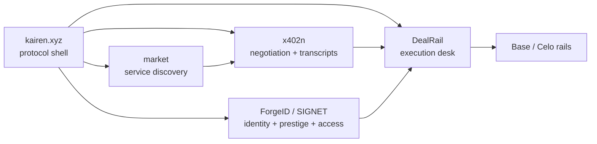

# Roadmap

This is the forward roadmap judges should use when evaluating DealRail’s upside.

It is grounded in the live product plus the broader local Kairen protocol repos under `/Users/sarthiborkar/Build/kairen-protocol`.

## Current Baseline

Live now:
- browser desk on Cloudflare
- backend API on Railway
- published npm package
- Base Sepolia and Celo Sepolia escrow evidence
- ERC-8004 verifier and hook integration
- x402 paid-request proof
- canonical agent artifacts for the CLI path

## Kairen Protocol Map

## Delivery Phases

### Phase 1: Final Submission Hardening

Status:
- now

Deliver:
- final demo video
- final scenario-first pitch
- conservative claim discipline

### Phase 2: x402n-Native Negotiation

Status:
- planned

Deliver:
- route DealRail requests into real x402n RFOs
- store transcript hashes and accepted-offer metadata
- expose negotiation history in browser and CLI

Why it matters:
- upgrades competition from curated demo ranking to live negotiation

### Phase 3: Market-Powered Discovery

Status:
- planned

Deliver:
- sync provider catalogs from `market`
- expose public service discovery feeds
- make Base-facing services publicly discoverable

Why it matters:
- upgrades discovery from curated demo supply to public market proof

### Phase 4: ForgeID / SIGNET Trust Upgrade

Status:
- planned

Deliver:
- map operators and providers to Kairen identities
- add prestige and attestation signals into execution policy
- move from generic ERC-8004 compatibility into Kairen-native trust

Why it matters:
- turns DealRail into the execution desk for a deeper identity and reputation stack

### Phase 5: ERC-8183 Productization

Status:
- planned

Deliver:
- canonical job, receipt, and deliverable schemas
- consistent browser, CLI, and backend objects
- cleaner integration story for third-party agent runtimes

### Phase 6: Production Hardening

Status:
- planned

Deliver:
- auth
- rate limits
- observability
- secrets rotation
- mainnet readiness review

### Phase 7: Sponsor Upgrades Worth Doing Later

Status:
- optional

Potential upgrades:
- real delegated MetaMask tx
- real Uniswap swap proof
- real Locus proof

## What We Will Not Fake

- full live x402n negotiation routing
- public marketplace-grade provider supply
- ForgeID / SIGNET enrollment in the current live DealRail flow
- sponsor-grade Uniswap, MetaMask, or Locus proof without tx evidence
